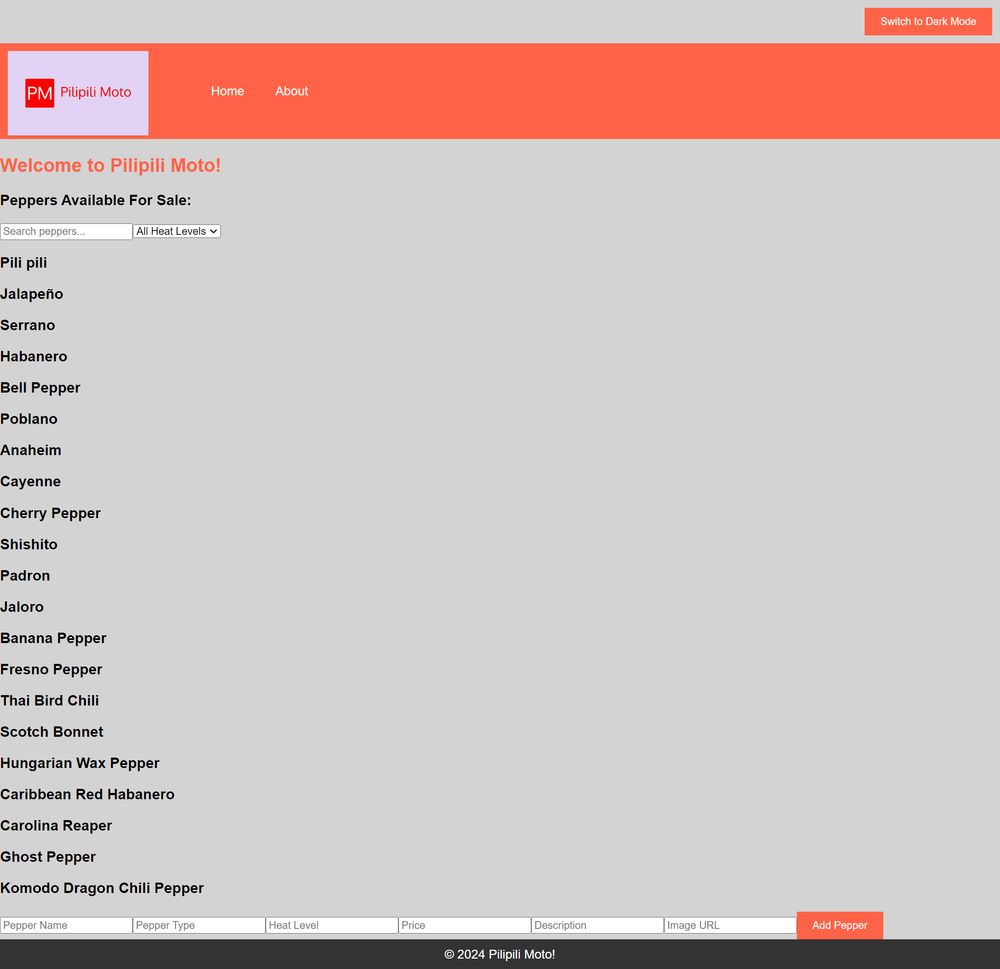

# Pilipili Moto

Pilipili Moto is a simple React application for displaying different types of peppers sold by a Kenyan shop owner. The app features a search functionality, filtering options and detailed pepper views. It also includes dark/light mode and is designed to be responsive and accessible.

## Features

- Display a list of peppers with search and filter options.
- View detailed information about each pepper.
- Add new peppers using a form.
- Toggle between dark and light mode.
- Responsive and accessible design.

## Installation

1. Clone the repository:

   - git clone https://github.com/KoryrKoryr/Pepper-Shop-App.git
   - cd pilipili-moto

2. Install the dependencies:

   - npm install

3. Run the React application:

   - npm start

4. Open the browser and navigate to http://localhost:3000/

## Screenshot

## Technologies Used

- **React:** JavaScript Library, React Router.
- **CSS:** for styling.
- **Database:** JSON Server at https://pilipili-moto-server.vercel.app/

## API Endpoints

The following endpoints are available in the JSON server:

- `GET /peppers`: Fetches a list of all peppers.
- `POST /peppers`: Adds a new pepper.
- `GET /peppers/:id`: Fetches details of a specific pepper.
- `GET /shopInfo`: Fetches the shop information.

## Usage

The app provides the following features:

1. **Search Peppers**: Use the search bar on the home page to find peppers by name.
2. **Filter Peppers**: Filter peppers by heat level using the dropdown filters.
3. **View Pepper Details**: Click on any pepper to view more detailed information, including heat level, price, and description.
4. **Add a New Pepper**: Use the form on the home page to add a new pepper to the list.
5. **Dark/Light Mode**: Toggle between dark and light mode using the button at the top right corner of the page.

## Hosted App

The app is hosted on vercel and can be accessed using the link below:

- [Pilipili Moto](https://pepper-shop-app.vercel.app/)
